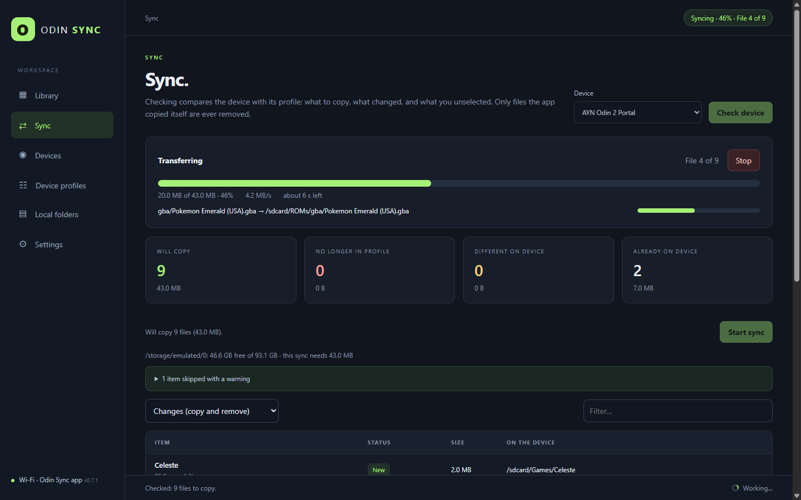
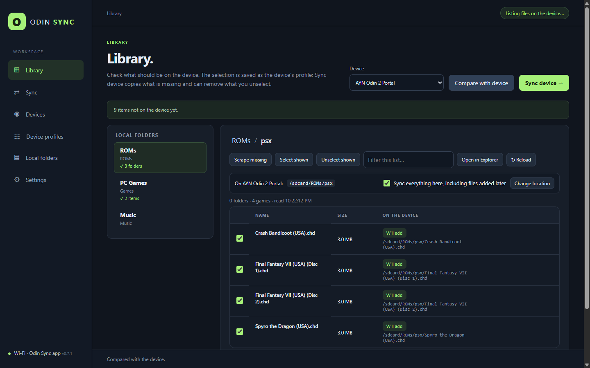
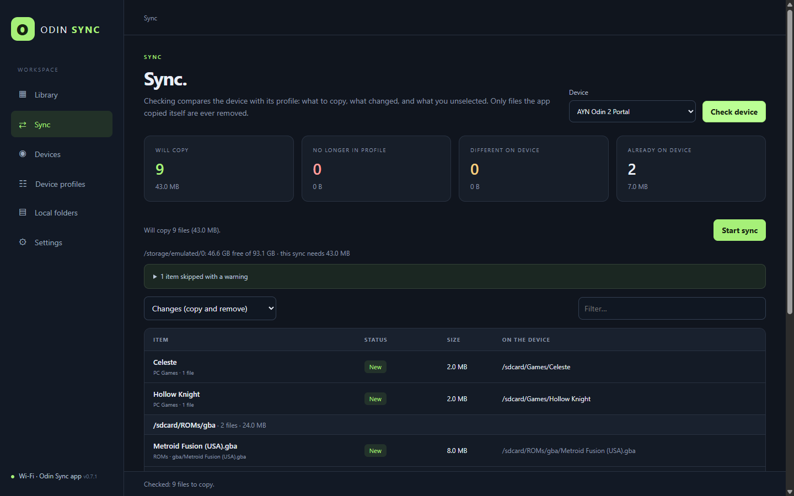
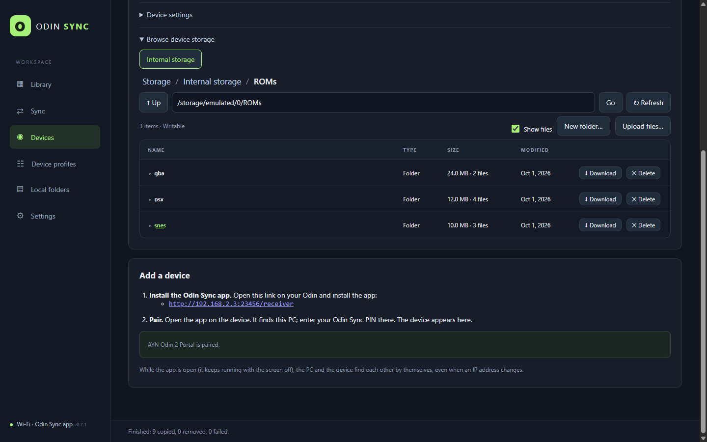

<p align="center"></p>

<h1 align="center">Odin Sync</h1>

<p align="center"><b>File transfer apps are a pain. This one isn't.</b><br>
Your PC game and media library on your Android handheld, over Wi-Fi. Pick it, hit Sync, done.</p>

<p align="center">
  <a href="https://github.com/duhmojo/odin-sync/releases/latest">Download</a> ·
  <a href="https://duhmojo.github.io/odin-sync/">Website</a> ·
  <a href="#get-started">Get started</a>
</p>



## The problem

| The usual way | With Odin Sync |
| --- | --- |
| ✕ Drag folders over one at a time | ✓ Tick what you want once, per device |
| ✕ Transfers die when the screen sleeps | ✓ Keeps going with the screen off |
| ✕ ADB, cables, developer options | ✓ A small app and your PIN |
| ✕ A dropped connection leaves half a game | ✓ Every file SHA-256 verified |
| ✕ Cleaning up on a tiny screen | ✓ Untick on the PC, it's removed safely |

## Get started

1. **Install Odin Sync on your PC** and set your PIN.
2. **Add your folders**: ROMs, PC games, music, videos.
3. **Install the app on your handheld** from the link in **Devices**. Allow it to access files.
4. **Pair**: in the app, tap **Find Odin Sync on the PC** and enter your PIN.
5. **Pick and sync**: tick what you want in **Library**, press **Sync device**.

Keep the app open while it syncs. It carries on with the screen off.

## What it does

### 🎮 Your library, per device



- **One profile per handheld**: where each folder goes, what belongs on it.
- **Tick a whole system**: new games you add later come along.
- **Compare with device**: see what was deleted there and what isn't synced yet.
- **Game-aware**: multi-disc sets travel together, PC games sync whole, `.DS_Store` stays home.

### 🔍 Know before you sync



- **A clear review**: new, changed, going away.
- **Free space checked** first.
- **Safe removals**: only files Odin Sync copied. Never your saves.

### 📱 The handheld's storage, from your desk



- **Browse** internal storage and SD cards with real folder sizes.
- **Upload and download** files and whole folders.
- **Finds the device by itself**, even on a new IP.

### ✨ And more

| | |
| --- | --- |
| 🖼️ **Artwork and ES-DE** | Covers, screenshots and details from libretro, ScreenScraper and Steam, uploaded into ES-DE |
| ⚙️ **GameNative configs** | The best community config for each PC game on your GPU |
| 🛋️ **Control from the couch** | Open Odin Sync on the handheld, land in your Library, signed in |
| 🕹️ **Low impact mode** | Cap the speed so you can keep playing while it syncs |
| 🔄 **Self-updating app** | New handheld app versions install from your PC in one tap |
| 🗂️ **Lives in the tray** | Starts with your PC, shows sync progress on the icon |

## Download

| Platform | File |
| --- | --- |
| Windows 10/11 | [odin-sync-windows-x64.exe](https://github.com/duhmojo/odin-sync/releases/latest/download/odin-sync-windows-x64.exe) |
| macOS (Intel and Apple silicon) | [odin-sync-macos.dmg](https://github.com/duhmojo/odin-sync/releases/latest/download/odin-sync-macos.dmg) |
| Linux | [AppImage](https://github.com/duhmojo/odin-sync/releases/latest/download/odin-sync-linux-x86_64.AppImage) · [.deb](https://github.com/duhmojo/odin-sync/releases/latest/download/odin-sync-linux-amd64.deb) |
| Handheld | Android 11+. Installs from the PC app (Devices → Add a device). |

> The builds aren't code-signed yet. Windows: **More info → Run anyway**. macOS: right-click the app → **Open**, the first time.

## How it works

```
 Your PC                          Your handheld
 Odin Sync  ──── Wi-Fi ────▶  Odin Sync app
 library, profiles,            receives files,
 inventory, web UI   ◀──────   reports status
```

- **Pair once** with your PIN. After that, every request is signed with a key only those two know.
- **Stays on your network.** No cloud, no account.
- **Settings** live in `%APPDATA%\Odin Sync` (Windows), `~/.config/Odin Sync` (Linux), `~/Library/Application Support/Odin Sync` (macOS).

## Build from source

Needs Node.js 20+.

```bash
npm ci
npm start          # run it (uses the same settings as the installed app)
npm test           # unit tests
npm run test:e2e   # the real app against a simulated device
npm run dist       # installer for this OS, in dist/
npm run screenshots # refresh docs/screenshots
```

`npm run dist` also builds the Android app. The first time, it offers to download a JDK and the Android SDK (about 0.5 GB). You accept the SDK licence yourself. The app is signed with your own key (`APK_KEYSTORE` / `APK_KEYSTORE_PASSWORD_FILE`). Keep it safe: updates only install over an app signed with the same key.

Set `ODIN_SYNC_DATA_DIR` to run with separate settings.

## License

Free to download and use for personal, non-commercial use. The source is here to read. Copying, modifying, redistributing, or bundling it with hardware or other products needs written permission. See [LICENSE](LICENSE).
